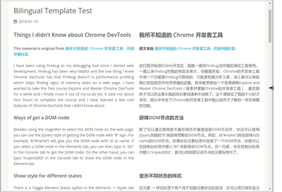

在 Hexo 中如果博客有双语写作的需求，其自带的国际化功能中通常的实践是为每一篇文章和主题模板都撰写对应的多语言副本，生成后通过点击链接进行整站语言切换。

如果只是有零星几篇双语文章，这样的成本未免有些大了，之前看到过翻译文章双栏对照的排版，觉得非常适合双语对照展示的场景，但 Google 一圈后并没有发现 Hexo 下有现成的模板，因此自己动手实现一下，顺便可以学习下 Hexo 模板的开发。

## 文章布局 Layout

Hexo 在创建新文章的时候可以指定文章的布局 layout，在生成时 Hexo 会调用主题 `layout` 目录下的对应 layout 文件进行文章的渲染。

``` shell
$ hexo new [layout] <title> # 或新建后在文档中指定 layout 项
```

<!--more-->

因此首先需要在 theme 中新建一个 layout 文件，可以从原有模板的文章默认 layout 复制一份作为基础对其进行修改。比如我这里复制后的路径是 `themes/icarus/layout/bil-post.ejs` 。

这样以后新建双栏对照文章只需：

```shell
$ hexo new bil-post <title>
```

接着修改复制得到的 layout，将原本引入文章文本的地方：

```html
<%- post.content %>
```

修改为：

```html
<% post.column = post.content.split('<!--second-column-->')  %>
<div class="article-bil-column bil-first-column">
    <%- post.column[0] %>
</div>
<div class="article-bil-column bil-second-column">
    <%- post.column[1] %>
</div>
<%- css('css/bilingual') %>
<%- js('js/bilingual') %>
```

这里将文章文本内容按标记 `<!--second-column-->` 分割，放在左右两栏的两个 `div` 中，再引入样式和脚本。

接着新建一个样式文件 `themes/icarus/source/css/bilingual.styl`，定义两栏的样式：

```css
.article-bil-column
    display: inline
    float: left
    width: calc(50% - 10px) /* 每栏各占宽 50%， 边界预留 10px 空白 */
    &.bil-first-column
        padding: 0 10px 0 0 
    &.bil-second-column
        padding: 0 0 0 10px
```

这样两栏就可以并排显示了。

## 同步滚动

实现双栏并排显示后还有一个问题需要解决。两种语言下的同一段话字数往往不同，所占用的版面行数会有所差距，篇幅一长两边便对应不上，影响对照的效果。因此需要两边内容上的同步滚动。

实现同步滚动有两种思路，第一种可以考虑令两边对应段落高度保持一致，略微扩充其中较短的一段，这种方式实现比较简单，但要求两边段落数量一致。第二种方式给每一段添加锚点标记，在页面滚动时，用 JS 控制一组锚点位置对齐，滚动效果很酷炫，但实现较为复杂，且需要额外考虑一些兼容问题。这里先选择实现第一种。

新建 `themes/icarus/source/js/bilingual.js`：

```javascript
(function($) {

    var leftParagraphs = $('.article-entry .bil-first-column').find('p, h1, h2, h3, h4, h5, h6');
    var rightParagraphs = $('.article-entry .bil-second-column').find('p, h1, h2, h3, h4, h5, h6');

    var align = () => {
        /* 如果页面宽度大于 800px，进行段落对齐，见下一节 */
        if(window.matchMedia('(min-width: 800px)').matches) {
            leftParagraphs.each((i, thiz) => {
                var left = $(thiz);
                var right = rightParagraphs.eq(i);

                left.removeAttr('style'), right.removeAttr('style');

                /* 取对应两段高度的最大值 */
                var maxHeight = Math.max(left.height(), right.height());
                left.height(maxHeight), right.height(maxHeight);
            });
        } else {
            leftParagraphs.removeAttr('style'), rightParagraphs.removeAttr('style');
        }
    }

    if(leftParagraphs.size() == rightParagraphs.size()) {
        var resizeHandler = 0;
        /* 监听窗口大小变化 */
        $(window).resize(() => {
            if(resizeHandler) {
                clearTimeout(resizeHandler);
            }
            resizeHandler = setTimeout(align, 50);
        });
        if($('#main img').size()) {
            $('#main img').load(align);
        } else {
            $(align);
        }
    }
})(jQuery);

```

## 响应式布局

在手机等屏幕较小的设备中，如果保持双栏显示会使正文栏变得很窄而影响阅读，解决办法是根据设备对布局做自适应处理，在屏幕宽度受限的情况下单栏平铺显示。

CSS 提供了媒体查询的接口，可用于为不同宽度的设备设置不同的样式，我使用的主题也定义了一些媒体类型的变量，因此只需在上面定义的样式基础上稍加扩展即可：

```css
@import "_variables"

.article-bil-column
    display: inline
    float: left
    @media mq-normal
        width: calc(50% - 10px)
        &.bil-first-column
            padding: 0 10px 0 0
        &.bil-second-column
            padding: 0 0 0 10px
    @media mq-tablet
        width: calc(50% - 10px)
        &.bil-first-column
            padding: 0 10px 0 0 
        &.bil-second-column
            padding: 0 0 0 10px
    @media mq-mobile
        width: 100%
    @media mq-mini
        width: 100%
```

再根据所使用主题的需要，加上对页面的其他元素的调整：

```css
#main
    width: 100%

/* 隐藏侧边信息卡片 */
aside#profile
    display: none 

/* 平铺右边文章列表栏 */
aside#sidebar
    display: block
    width: 100%;
```

效果：



## Demo

> [Bilingual Template Test](/misc/Bilingual-Template-Test/)
