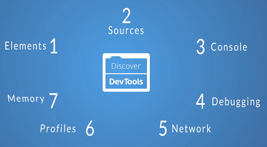
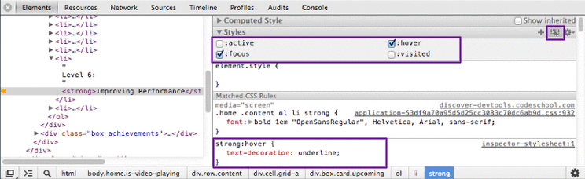
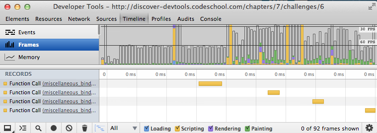

## Things I didn’t Know about Chrome DevTools

** This material is originally from [我所不知道的 Chrome 开发者工具 - 开源中国社区](http://www.oschina.net/translate/things-i-didnt-know-about-chrome-devtools?cmp). **

I have been using Firebug as my debugging tool since I started web development. Firebug has been very helpful and the one thing I knew Chrome DevTools has that Firebug doesn’t is performance profiling which helps finding signs of memory leaks on a web page. I have wanted to take the free course Explore and Master Chrome DevTools for a while and I finally cross it out of my to-do list. It took me about four hours to complete the course and I have learned a few cool features of Chrome DevTools that I didn’t know about.

<!--more-->

### Ways of get a DOM node

Besides using the magnifier to select the DOM node on the web page, you can use the jQuery style of getting the DOM node with “$” sign. For example, $(“#name”) will give you the DOM node with id as name. If you select a DOM node in the Elements tab, you can then type in “$0″ in the Console tab to get the DOM node. On the other hand, you can type “inspect($0)” in the Console tab to show the DOM node in the Element tab.

### Show style for different states

There is a Toggle Element States option in the Elements -> Styles tab which will open the section for you to set the element state to active, focus, hover, and visited. I found this very helpful to debug the style issue for these states as the style definitions won’t be shown in the Styles tab unless they are in that state.

### Dynamical editing source files and data source and view the change history

You can edit CSS files or JavaScript files under the Sources tab. Right click in the file, you will see the option “Local modifications…” to see the change history and revert them. While we are used to editing CSS files, dynamically being able to update JavaScript is very useful.

### Save updated file locally

The changes were saved in the Chrome local storage if you edit them in the Sources tab and you can also save the updated files in your computer and override the original ones.

### Events/Frames view in Timeline

The Timeline tab provides three types of views for the recording: Events, Frames, and Memory. The Events/Frames view shows the time spent on HTML parsing(blue), JavaScript rendering(yellow), style calculation(purple), and CSS rendering(green). The memory view is for detecting the sign of memory leaks.

### Other plugins

Page speed: It’s similar to YSlow. It gives you the suggestions of improving performance. After it’s installed, it’s will be shown as a new tab in the devTools.
Google Closure: Compress multiple JavaScript files into one to reduce the number of HTTP requests.

Above are just new things that I learned in the class and I enjoyed taking this interactive class. Visit this link for more details about how to improve the performance of your application with Chrome DevTools.

<!--second-column-->

## 我所不知道的 Chrome 开发者工具

** 原文来自 [我所不知道的 Chrome 开发者工具 - 开源中国社区](http://www.oschina.net/translate/things-i-didnt-know-about-chrome-devtools?cmp). **

自打我开始进行Web开发后，我就一直将Firebug当作我的调试工具使用。一直以来Firebug对我的帮助非常大，但据我所知，Chrome的开发者工具中有一个功能是Firebug不具有的，它就是性能分析工具，该工具可以帮助我们发现网页中内存泄漏的迹象。我早就想参加一下免费课程Explore and Master Chrome DevTools（探索并掌握Chrome的开发者工具），最后我终于可以把这事从我的待办事项清单中划掉了。这个课程花了我四个小时才学完，我从中学会了Chrome的开发者工具中我以前并不了解的一些非常酷的功能。

### 获得DOM节点的方法

除了可以通过使用放大器在网页中直接选取DOM节点外，你还可以使用jQuery风格的“$”来获得想要的DOM节点。例如，$(“#name”)将会获得id为name的DOM节点。如果你在元素标签中选择了一个DOM节点，你就可以在控制台标签中键入“$0″来获得该DOM节点。另一方面，你在控制台标签中键入“inspect($0)”，就可以转到显示该节点的元素标签中了。

### 显示不同状态的样式

在元素 --> 样式标签下有个用于切换元素状态的选项，你可以用它将所选元素的状态设置为active（激活）, focus（聚焦）, hover（鼠标悬停）和visited（已访问过）。我发现这个对于调试这些状态的样式问题帮助非常大，因为在样式标签下只显示当前状态下的样式定义。

### 动态编辑源文件和数据源并查看修改的历史记录

你可以在源文件标签下修改CSS文件或者JavaScript文件。鼠标右键点击文件，你将看到有个“本地修改。。。”这个菜单，单击该菜单你就能看到该文件的修改历史记录并可以对它们进行恢复操作。尽管我们已经习惯了编辑CSS文件，但能够动态的更新JavaScript用处可大了。

### 将更新的文件保存到本地

如果你在源文件标签中对文件进行了修改，Chrome会将这些修改保存到它的本地存储之中。你也可以将修改后的文件保存到你的计算机之中并用它们覆盖原先的文件。

### 时间线中的事件/帧视图

时间线标签为Chrome所记录下来的内容提供三种类型的视图: 事件、帧和内存 The 事件/帧视图显示的是花在HTML解析（蓝色部分）、JavaScript渲染(黄色部分)、样式计算(紫色)以及CSS渲染(绿色)等方面的时间。内存视图是用来寻找内存泄漏的迹象的。

### 其它插件

页面速度（Page speed）：它同YSlow类似，可以在提高性能方面为你提出一些建议。安装完成后，它会作为开发者工具中的一个新标签显示出来。
Google Closure：将多个JavaScript文件压缩为一个文件，以减少HTTP请求的个数。

上面只是我从这个课程中学到的一些新东西。我非常乐于参加这个交互式课程。想要了解更多关于如何通过使用Chrome的开发者工具来提高你的应用的性能的细节，请访问这个链接。
